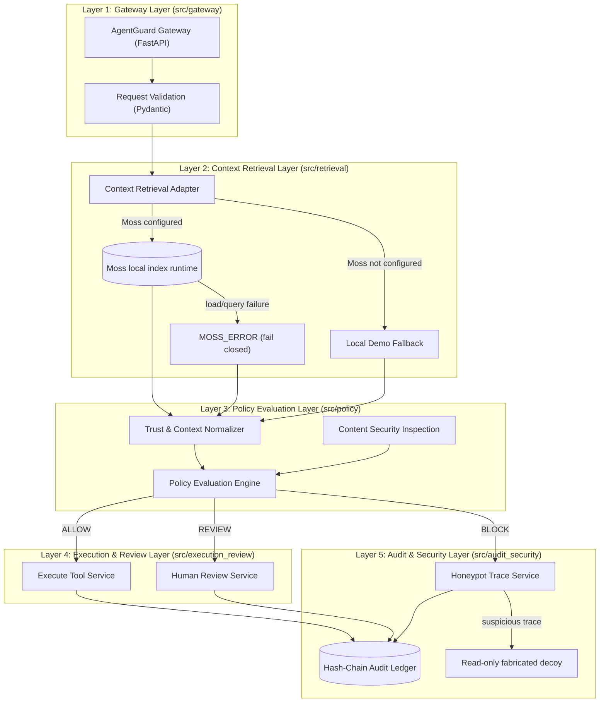

# AgentGuard Architecture

## Product Goal

AgentGuard is a prototype runtime safety gateway for transaction-oriented AI agents. It evaluates an agent tool request against retrieved context before a simulated tool call, returns an explainable allow, block, or review decision, and records application-level audit evidence.

## System Architecture: The 5 Core Layers

The repository is modularized into 5 distinct architectural layers directly reflecting the system architecture diagram (`architecture.pdf`):



---

### Layer 1: Gateway Layer (`src/gateway/`)
- **Components**: `AgentGuard Gateway` (`api.py`), `api_models.py`
- **Technologies**: FastAPI, Python, Pydantic
- **Role**: Handles HTTP requests from autonomous AI agents, validates payloads (`ToolRequest`, `ReviewDecisionRequest`), enforces schemas, and returns typed decisions (`GuardResponse`).

### Layer 2: Context Retrieval Layer (`src/retrieval/`)
- **Components**: `retrieval_service.py`, `moss_client.py`, `local_retrieval.py`, `retrieval_models.py`
- **Technologies**: Moss Python SDK with its local Rust runtime, Python, and SQLite for the explicit local demo provider
- **Role**: Loads the configured Moss cloud index into the local runtime, then queries it with an exact `doc_hash` metadata filter. `LOCAL_DEMO` is selected only when Moss is unconfigured; a configured-provider failure becomes `MOSS_ERROR` and is blocked by policy.
- **Demo evidence join**: Retrieved invoice metadata is joined by invoice ID to the separate fabricated `approval_records.json` fixture before content checks. A caller-provided approval amount is not used as the trusted approval fact.

### Layer 3: Policy Evaluation Layer (`src/policy/`)
- **Components**: `policy_engine.py`, `policy_models.py`, `context_normalizer.py`, `moss_validator.py`, `evaluator.py`, `evaluation_cases.py`
- **Technologies**: Python and Pydantic models
- **Role**: Normalizes trust metadata, enforces strict action-specific thresholds (e.g. 0.90+ for payments, 0.85+ for autonomous execution, 0.70–0.85 for human review), and detects prompt injection and tampering attempts.

### Layer 4: Execution & Review Layer (`src/execution_review/`)
- **Components**: `execution_service.py`, `execution_models.py`, `review_service.py`, `review.py`
- **Technologies**: Python, SQLite sandbox ledger, and Streamlit HITL UI
- **Role**: Writes an idempotent fabricated sandbox payment record for approved payments; other allowed actions remain simulated. `REVIEW` is stored in a durable SQLite queue and cannot execute before review.

### Layer 5: Audit & Security Layer (`src/audit_security/`)
- **Components**: `blockchain.py`, `audit_service.py`, `security_analysis.py`, `security_service.py`, `honeypot.py`
- **Technologies**: Full SHA-256 application hash chain, SQLite, Python, and local JSONL security traces in an OpenTelemetry-compatible shape
- **Role**: Records request, sandbox, review, latency, and security trace references in a local hash chain. Selected suspicious blocks expose a fabricated read-only decoy whose access is logged. This is not an external blockchain or production intrusion monitoring system.

---

## Backward Compatibility & Package Imports

All modules can be imported using either the clean layer packages or top-level compatibility facades:

```python
# Modern Layered Imports
from src.gateway import ToolRequest, GuardResponse
from src.retrieval import retrieve_context, search_moss
from src.policy import evaluate_policy, runtime_guard
from src.execution_review import execute_tool, create_pending_review
from src.audit_security import add_to_ledger, verify_audit_chain

# Top-level Facade Imports (via src/__init__.py)
from src import guarded_tool_call, runtime_guard, evaluate_batch

# Legacy Shims (100% backward compatible with existing code and tests)
from src.agent import guarded_tool_call
from src.retrieval_service import retrieve_context
from src.blockchain import LEDGER, verify_ledger
```
